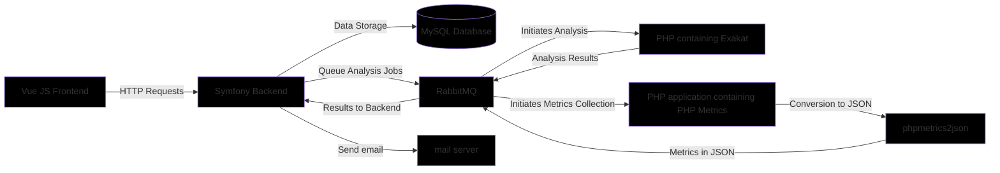

```mermaid
graph LR
    A[Vue JS Frontend] -- HTTP Requests --> B[Symfony Backend]
    B -- Data Storage --> C[(MySQL Database)]
    B -- Queue Analysis Jobs --> D[RabbitMQ]
    D -- Initiates Analysis --> E[PHP containing Exakat]
    D -- Initiates Metrics Collection --> F[PHP application containing PHP Metrics]
    F -- Conversion to JSON --> G[phpmetrics2json]
    E -- Analysis Results --> D
    G -- Metrics in JSON --> D
    D -- Results to Backend --> B
		B -- Send email --> H[mail server]

    style A fill:#000000
    style B fill:#000000
    style C fill:#000000
    style D fill:#000000
    style E fill:#000000
    style F fill:#000000
    style G fill:#000000
	style H fill:#000000
```